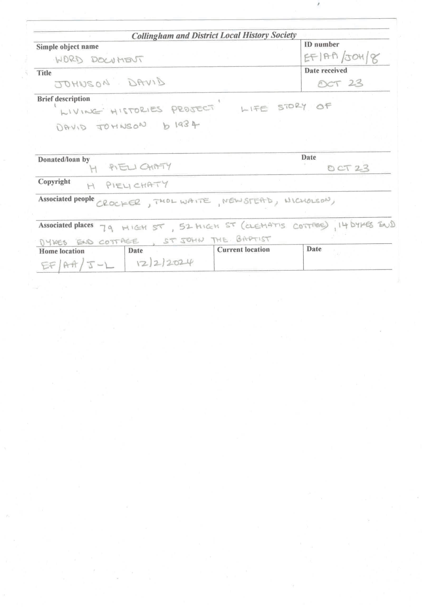

# CDLHS Archive Digitisation

This repository brings together the CDLHS archive digitisation work:

- `catalogue/` - the latest recovered archive review app, SQLite catalogue, name lexicon, and preserved olmOCR card experiment from 4 July 2026
- `project/` - the earlier React archive admin app
- `PythonProjectDatabaseFeeder/` - the earlier local OCR ingestion toolchain

The goal is to turn scanned archive cards into searchable records, let staff review OCR output in the browser, and save corrected data into the archive database.

## Recovered card and name-correction work

The July work continued in [collingham-archive-catalogue](https://github.com/lozknowles/collingham-archive-catalogue) and is now included here under `catalogue/`, through source commit `5d512a647510562a285d49653c980f26723b2cad`.

The example was the two-page **David Johnson life-story card**. OCR read the donor/copyright name as **H PIEU CHATY**; human review supplied **H PIELICHATY**. The surname and its observed OCR spelling are stored in the local lexicon. The archive reference was also corrected from `EF/AA/JOH/8` to `EF/AA/JOH/7`.

- [Original card](catalogue/poc/card.pdf)
- [Raw OCR transcript](catalogue/poc/output/card/card.md)
- [Sample record and correction notes](catalogue/data/sample/david-johnson-card.md)
- [Recovery provenance and current limits](docs/recovered-ocr-work.md)

The catalogue app provides record search, editable fields, a correction review queue, and lexicon entries/variants. It retains raw OCR, suggested values, accepted values, and review history separately. The sample stays labelled as sample data.

The saved lexicon is the correction memory. Automatic lexicon matching during future OCR runs and model training are **not implemented**. The Flask catalogue and the earlier React/Django apps remain separate applications; their databases are not automatically synchronised.

## Start the catalogue review app

From the repository root, with Python 3.10 or newer:

```bash
cd catalogue
python -m venv .venv
```

Activate it with `source .venv/bin/activate` on Linux/macOS, or `.venv\Scripts\Activate.ps1` in Windows PowerShell, then run:

```bash
python -m pip install -r requirements.txt
python run_app.py
```

Open [the local review app](http://127.0.0.1:8000). The first request creates a local sample database. Set `COLLINGHAM_DB` to select a different database; `COLLINGHAM_PORT` changes the port. The app binds to loopback with debugging disabled by default. It is an unauthenticated local review tool, not a public deployment.

To verify the review workflow using temporary test databases:

```bash
python -m pip install -r requirements-dev.txt
python -m pytest
```

## What it does

- reads archive card scans and PDFs
- extracts OCR text from each page
- presents OCR drafts for human review
- supports archive record creation, editing, search, and checkout tracking
- keeps the workflow local and charity-friendly, without requiring paid OCR APIs

## Project layout

- `catalogue/` - Flask/SQLite review app, correction history, lexicon, and original OCR evidence
- `catalogue/poc/` - preserved P5000 olmOCR scripts, scans, page images, and output
- `project/` - browser app built with React, TypeScript, Vite, Tailwind, and `sql.js`
- `PythonProjectDatabaseFeeder/` - local OCR and feeder scripts for PDFs and card images
- `collingham_archive/` - Django-based archive model and CRUD work
- `PythonProjectDatabaseFeeder/card.png` - sample card image for OCR collaboration and testing

## Sample card



## Browser app

The earlier browser admin app includes:

- card maintenance
- search
- checkout management
- OCR review

The OCR review screen shows the raw extracted text alongside editable archive fields so staff can correct OCR before saving.

## OCR workflow

The earlier local OCR pipeline:

1. renders PDF pages to images
2. preprocesses each page
3. runs OCR using local tooling
4. writes draft output to JSON and CSV
5. loads OCR review data into the browser app for human correction

## Earlier applications: local setup

### Browser app

```bash
cd project
npm install
npm run build
npm run dev
```

### OCR feeder

```bash
cd PythonProjectDatabaseFeeder
python -m pip install -r requirements.txt
python cardreader.py
```

## Environment

The OCR scripts read local secrets and runtime settings from `PythonProjectDatabaseFeeder/.env`.

Important variables include:

- `OPENAI_API_KEY`
- `TESSERACT_CMD`
- `CARD_PDF_PATH`
- `OCR_OUTPUT_DIR`
- `OCR_ENGINE`
- `OCR_MANUAL_THRESHOLD`

## Notes

- The OCR output is draft quality for handwriting and must be reviewed before import.
- The app is browser-based and intended for administrative use.
- The repository currently favors local, no-cost tooling over paid API services.
