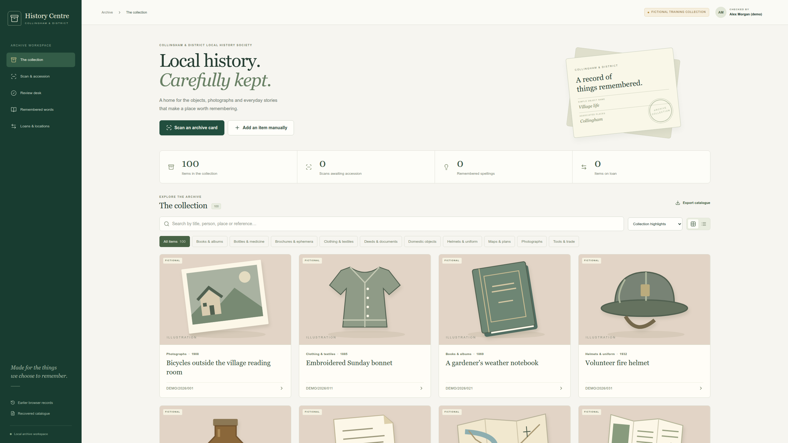

# Collingham History Centre · Archive workspace

A browser workspace for the Collingham and District Local History Society: familiar paper cards, a searchable collection, local OCR and careful human review.



The new workspace joins the React interface to the recovered Flask/SQLite catalogue. Cards retain the original front/back field arrangement, with a modern collection view, photographs, storage locations, loans and an audit history.

- Scan a card PDF or photograph, compare the original with the editable card, resolve uncertain readings and confirm accession.
- Remember a checked spelling. Later scans suggest that correction while retaining raw OCR and requiring human approval.
- Enter a card manually when an object has no existing card.
- On mobile, use **Take item photo** before accession, check the preview, and attach the image when saving the item. **Choose photos** provides a file/gallery alternative.
- Search, edit, loan, return and export records from the same SQLite catalogue.

[Watch the captioned 1440p walkthrough](docs/demo/collingham-archive-walkthrough-1440p.mp4) · [Setup and workflow guide](docs/card-workspace.md) · [100 fictional training records](catalogue/demo/collection.json)

## Start the browser workspace

Requirements: Python 3.10+, Node.js 20+ and npm. Scanning also needs Tesseract with English data and Poppler (`pdftoppm`) on PATH. Manual accession and photographs work without the OCR programs. No paid API or model download is required.

From the repository root:

```bash
cd project
npm ci
npm run build
cd ..
python -m venv catalogue/.venv
```

Activate with `source catalogue/.venv/bin/activate` on Linux/macOS, or `catalogue\.venv\Scripts\Activate.ps1` in Windows PowerShell, then:

```bash
python -m pip install -r catalogue/requirements.txt
python catalogue/run_app.py
```

Open [the archive workspace](http://127.0.0.1:8000/workspace/). The default database contains the recovered sample card. The older Flask screens remain available at `/records`, `/review-queue` and `/lexicon`.

The launcher binds to loopback with debugging disabled. This is a local, unauthenticated workspace; a public or shared deployment needs separate hosting and access-control work. A physical phone must reach an appropriately configured host before it can use the app.

## Try the separate fictional collection

Stop your development server, then create a **new** database:

```bash
python catalogue/scripts/create_demo_database.py --db catalogue/runtime/demo.sqlite
```

The command refuses to overwrite any existing file. Select it before starting the server:

```bash
# Linux/macOS, from the repository root
export COLLINGHAM_DB="$PWD/catalogue/runtime/demo.sqlite"
python catalogue/run_app.py
```

```powershell
# Windows PowerShell, from the repository root
$env:COLLINGHAM_DB = (Resolve-Path catalogue/runtime/demo.sqlite).Path
python catalogue/run_app.py
```

There are exactly **100 fictional items**, ten in each of ten archive categories. Illustrations are labelled; the example bottle photograph is AI-generated. All people, holdings and provenance in this dataset are invented. Two additional training cards demonstrate scan accession; a manually entered bottle takes the walkthrough total to 103.

The filmed Tesseract run measured 97.94% word accuracy on the first synthetic card, then 100% after review. A separate later card measured 97.92% raw and 100% after the saved spelling was suggested. Those are measurements against the known text of two fixtures, **not a general accuracy claim or model retraining**. See [the evidence and limitations](docs/card-workspace.md#verification).

## The recovered Helena correction

The earlier work is preserved from [collingham-archive-catalogue](https://github.com/lozknowles/collingham-archive-catalogue), commit `5d512a647510562a285d49653c980f26723b2cad` (4 July 2026). The David Johnson card read **H PIEU CHATY**, corrected by a person to **H PIELICHATY**; its reference was corrected from `EF/AA/JOH/8` to `EF/AA/JOH/7`.

[Original card](catalogue/poc/card.pdf) · [Raw transcript](catalogue/poc/output/card/card.md) · [Recovery evidence](docs/recovered-ocr-work.md) · [Import manifest](catalogue/UPSTREAM.json)

The new scan pipeline can consult confirmed lexicon variants. The preserved July olmOCR experiment is unchanged. The fictional demonstration uses **Helena Quillmere**, an invented person, so no synthetic provenance is attached to the recovered real sample.

## Development and verification

```bash
python -m pip install -r catalogue/requirements-dev.txt
python -m pytest catalogue/tests
cd project
npm run typecheck
npm run build
```

The full [browser verification and recording instructions](docs/card-workspace.md#verification) require a fresh synthetic database and the native OCR programs. Tests use temporary databases; existing archivist records and uploaded photographs must never be test fixtures.

## Repository areas

- `catalogue/`: shared SQLite catalogue, Flask API, scan processing, review history, lexicon, synthetic fixtures and preserved July evidence.
- `project/`: new React workspace plus the earlier browser app at `/workspace/#/legacy`. Its existing `archiveDb` local storage is preserved, separately from SQLite.
- `PythonProjectDatabaseFeeder/`: earlier OCR ingestion tools.
- `collingham_archive/`: earlier Django models and CRUD work.

The legacy browser, feeder and Django stores are not automatically migrated. Back up the selected SQLite database **and its uploads directory together**; the JSON catalogue export is not a full media/history backup.
